<div align="center">

# Academic PPT · 学术 PPT

**为研究生学术汇报生成内容充实、图示清晰、原生可编辑的 PowerPoint。**

原名 Lyceum · 吕克昂。保留 `lyceum` 技能入口，已有安装和调用方式兼容。

[English](README.md) · [简体中文](README.zh-CN.md) · [设计文档](DESIGN.md) · [MIT](LICENSE)

</div>

## 先选两件事：场景 + 视觉主题

一份 PPT 由两个**互相独立**的选择决定：

- **场景（6 种）**：决定页数、页面骨架、论证顺序、时长、标志性图形 —— 组会 / 会议 / 进展 / 答辩 / 开题 / 文献分享。
- **视觉主题（19 套）**：决定纸张底色、卡片、封面、主色阶梯、强调色、图表色阶 —— 完整色值、选择规则和提示词模板见 [**`theme-index.md`**](skills/lyceum/references/theme-index.md)。

**学术蓝白只是 19 套里的一套，也是兜底方案，不是全部。** 请求里没写主题时，技能应先问一次用哪套风格，而不是直接默认成学术蓝白。
主题可以跨场景组合，例如「开题骨架 + 藏青金配色」：保留 `proposal.md` 的页面结构，只取 `conference.md` 的色值。

### 19 套主题一览

| 分组 | 主题（中文 / English） |
|---|---|
| 兜底 | [学术蓝白 / Academic Blue](examples/theme-preview/theme-01.png) |
| 组会 | [研纸墨蓝 / Ink Paper](examples/theme-preview/theme-02.png) · [暖砂陶 / Warm Sand](examples/theme-preview/theme-03.png) · [夜航实验室 / Midnight Lab（深色）](examples/theme-preview/theme-04.png) |
| 会议 | [藏青金 / Navy & Gold](examples/theme-preview/theme-05.png) · [林壑墨绿 / Forest Sage](examples/theme-preview/theme-06.png) · [讲坛酒红 / Burgundy Lecture](examples/theme-preview/theme-07.png) |
| 进展 | [卷宗红 / Dossier Vermilion](examples/theme-preview/theme-08.png) · [党建正红 / Crimson Dossier](examples/theme-preview/theme-09.png) · [石板青 / Slate Contract](examples/theme-preview/theme-10.png) |
| 答辩 | [学院蓝 / Academy Blue](examples/theme-preview/theme-11.png) · [学院红金 / Classic Crimson](examples/theme-preview/theme-12.png) · [石板牛津 / Slate Oxford](examples/theme-preview/theme-13.png) |
| 开题 | [蓝图青 / Blueprint Teal](examples/theme-preview/theme-14.png) · [青苗计划 / Sage Plan](examples/theme-preview/theme-15.png) · [石墨工程 / Graphite](examples/theme-preview/theme-16.png) |
| 文献分享 | [纸边笔记 / Paper Margin](examples/theme-preview/theme-17.png) · [暖页批注 / Warm Margin](examples/theme-preview/theme-18.png) · [冷阅审稿 / Cool Review](examples/theme-preview/theme-19.png) |

### 主题预览（每套一页，点开看大图）

**上表里每个主题名都是链接，直接指向对应效果图。** 19 页使用同一篇论文内容（Yu et al.,
*Accelerating Multi-Agent Planning Using Graph Transformers with Bounded Suboptimality*, ICRA 2023；
数值取自原文 Fig. 4 / Fig. 5），只有配色、卡片、封面和标志性图形不同。

|  |  |  |
|---|---|---|
| **01 学术蓝白**<br><a href="examples/theme-preview/theme-01.png">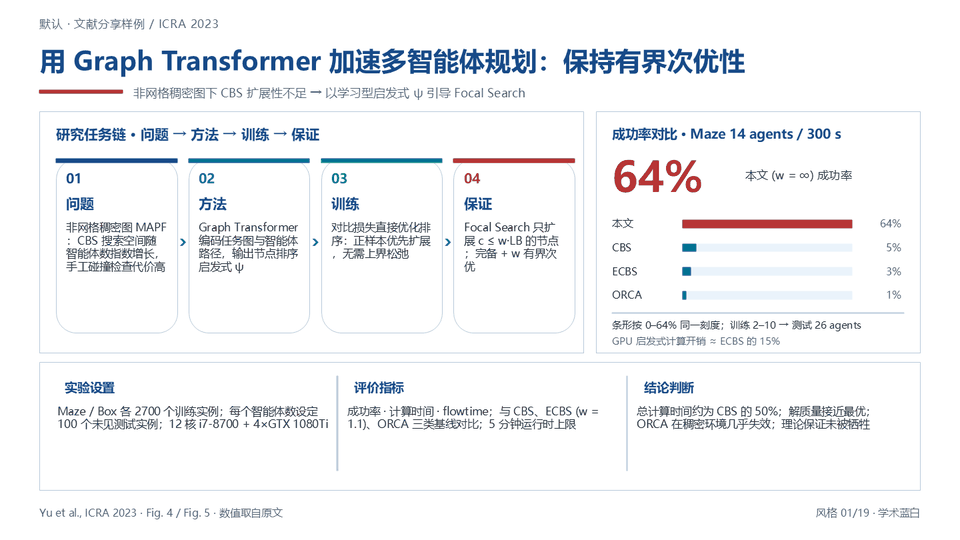</a> | **02 研纸墨蓝**<br><a href="examples/theme-preview/theme-02.png">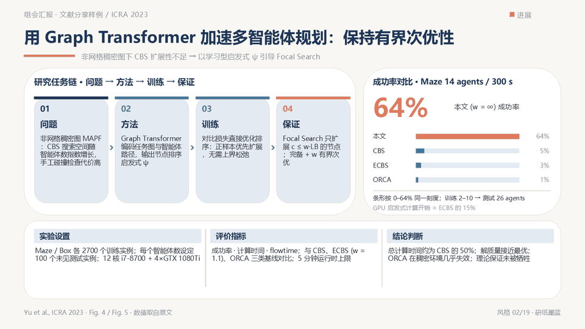</a> | **03 暖砂陶**<br><a href="examples/theme-preview/theme-03.png">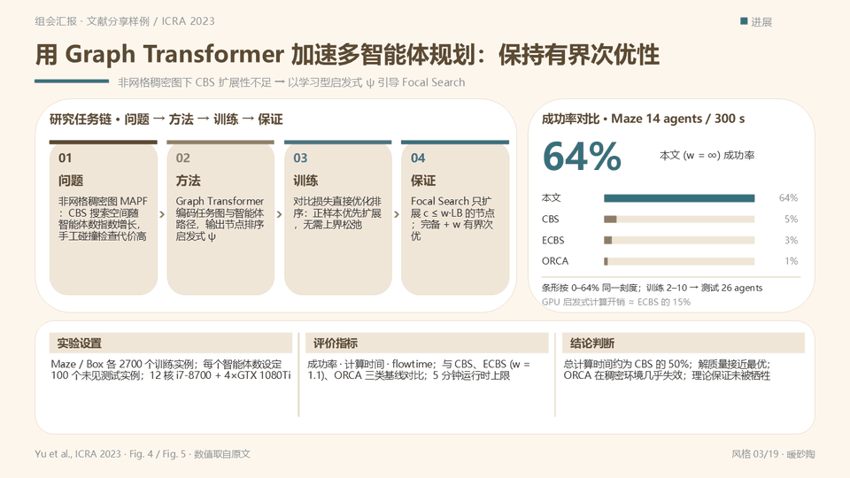</a> |
| **04 夜航实验室**<br><a href="examples/theme-preview/theme-04.png">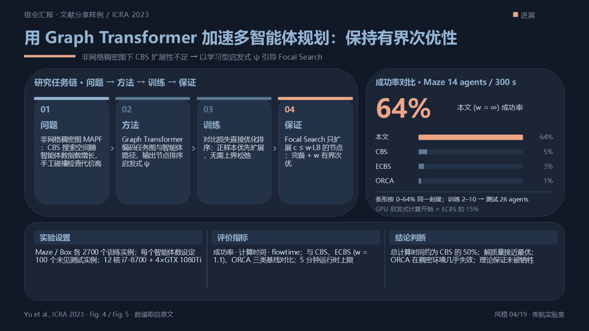</a> | **05 藏青金**<br><a href="examples/theme-preview/theme-05.png">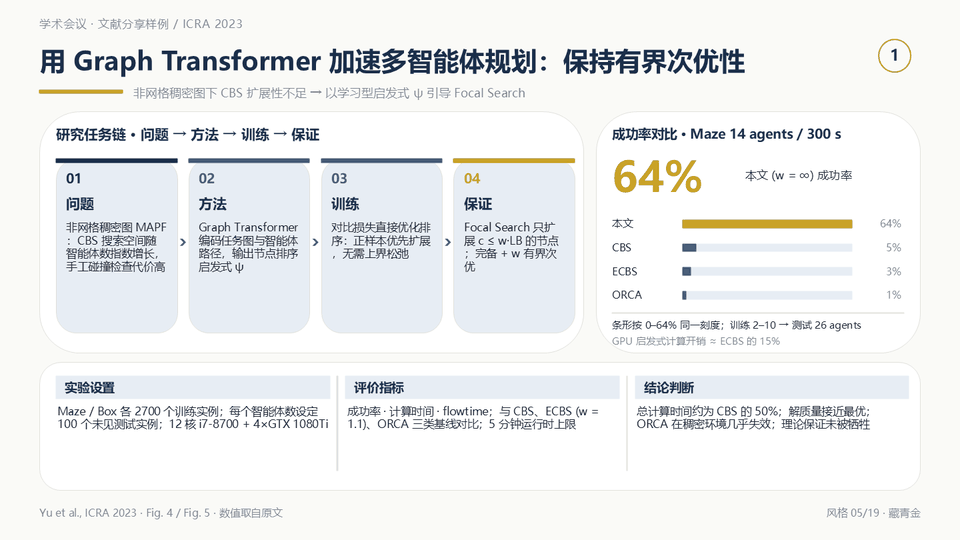</a> | **06 林壑墨绿**<br><a href="examples/theme-preview/theme-06.png"></a> |
| **07 讲坛酒红**<br><a href="examples/theme-preview/theme-07.png">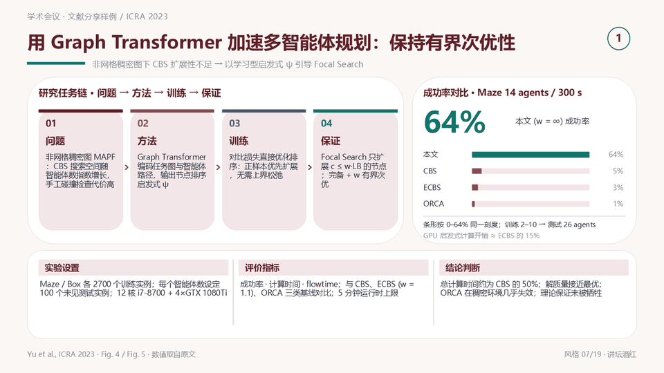</a> | **08 卷宗红**<br><a href="examples/theme-preview/theme-08.png"></a> | **09 党建正红**<br><a href="examples/theme-preview/theme-09.png">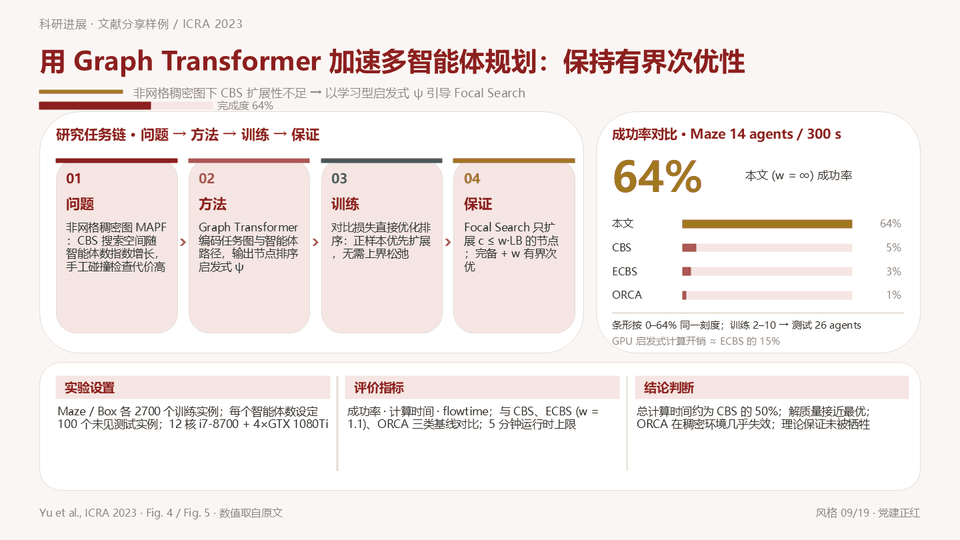</a> |
| **10 石板青**<br><a href="examples/theme-preview/theme-10.png">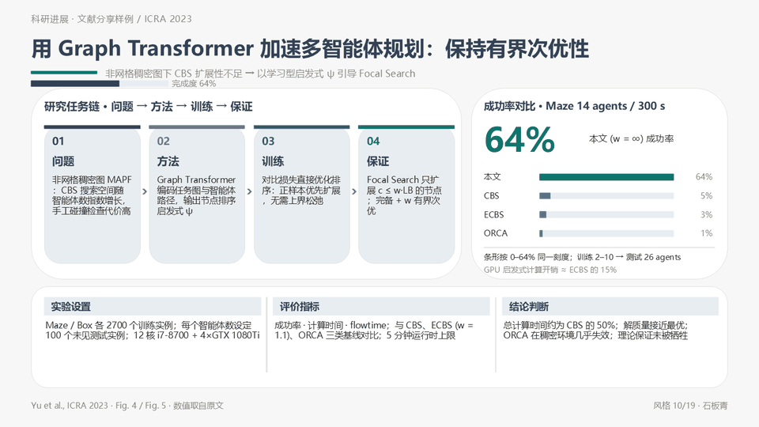</a> | **11 学院蓝**<br><a href="examples/theme-preview/theme-11.png">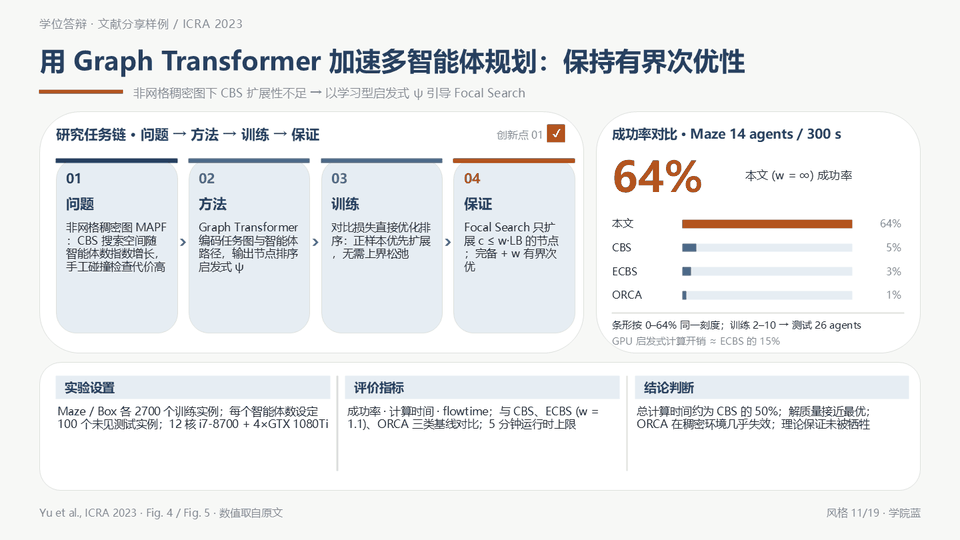</a> | **12 学院红金**<br><a href="examples/theme-preview/theme-12.png">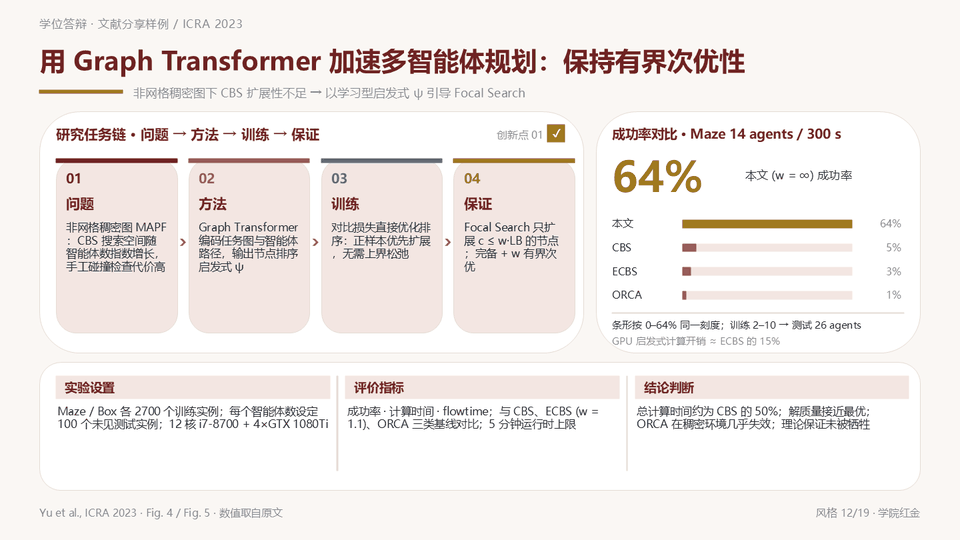</a> |
| **13 石板牛津**<br><a href="examples/theme-preview/theme-13.png">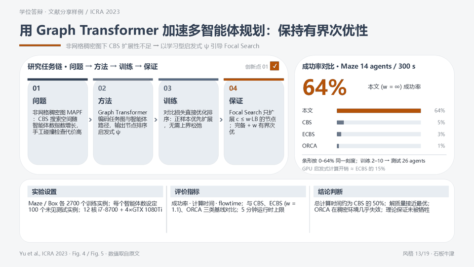</a> | **14 蓝图青**<br><a href="examples/theme-preview/theme-14.png">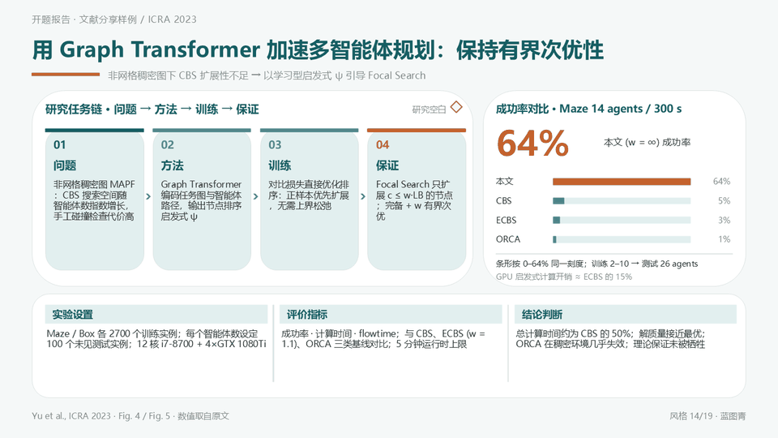</a> | **15 青苗计划**<br><a href="examples/theme-preview/theme-15.png">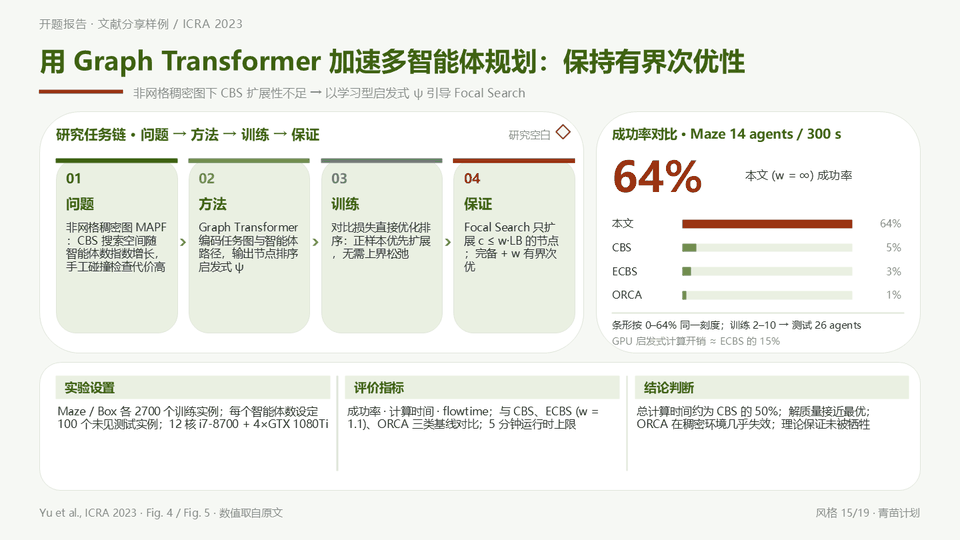</a> |
| **16 石墨工程**<br><a href="examples/theme-preview/theme-16.png">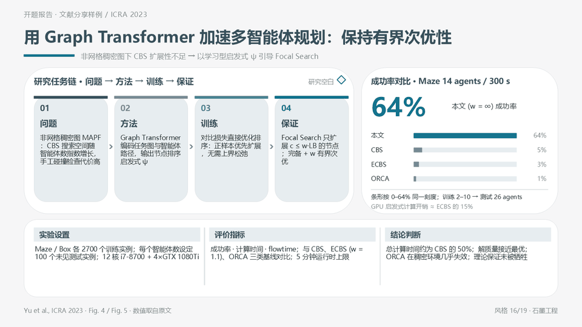</a> | **17 纸边笔记**<br><a href="examples/theme-preview/theme-17.png">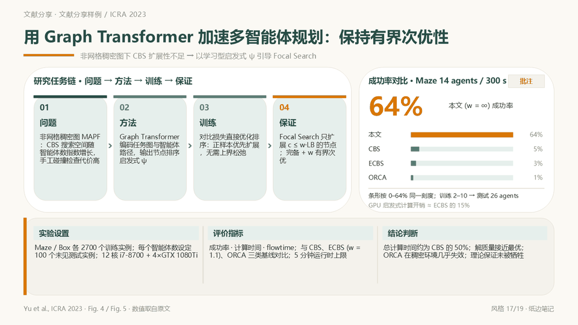</a> | **18 暖页批注**<br><a href="examples/theme-preview/theme-18.png">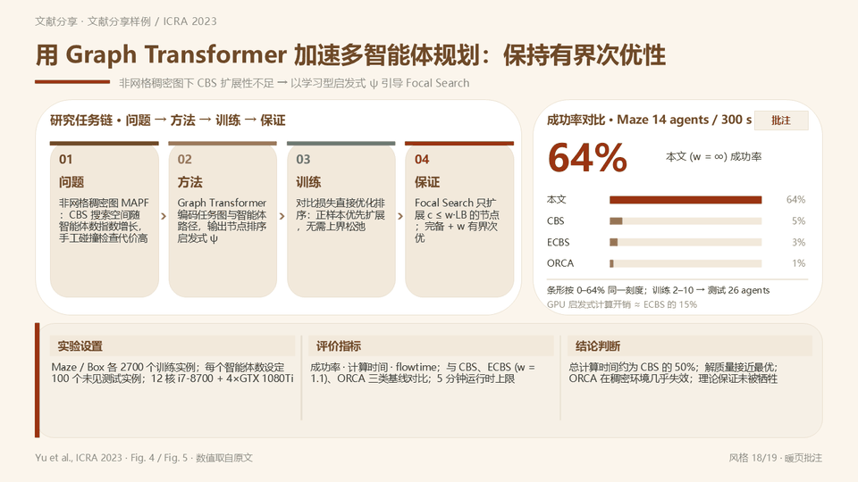</a> |
| **19 冷阅审稿**<br><a href="examples/theme-preview/theme-19.png">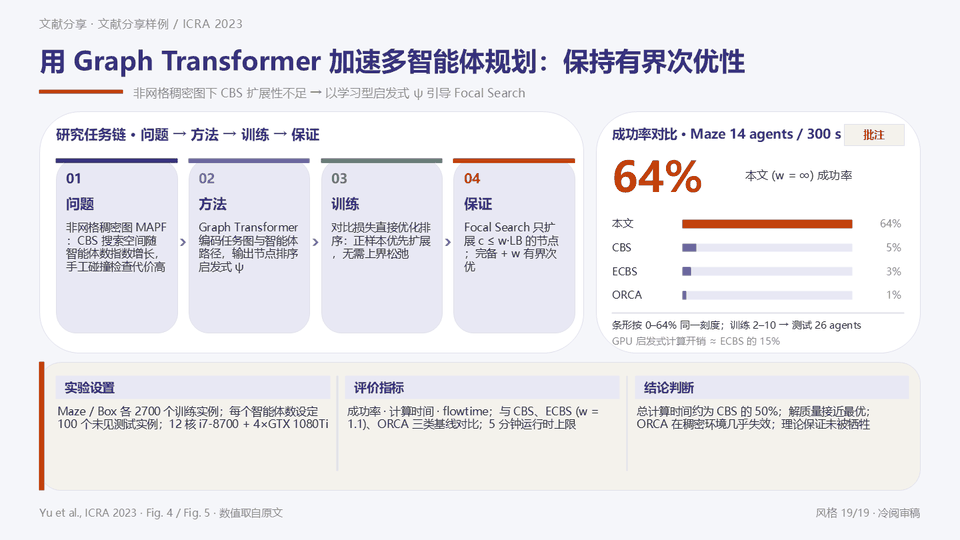</a> |  |  |

[19 套带名称的拼版总览图](examples/theme-preview/theme-overview.png) ·
[完整色值与提示词模板](skills/lyceum/references/theme-index.md)

### 到底怎么用（重点）

**在请求里写出主题名**，点名后整套生效，不得回落到学术蓝白：

```text
用 Lyceum 做一份 18 页的学位答辩 PPT，视觉主题用「学院红金」。
保留答辩场景的页面骨架和创新点方块，封面、卡片、表格、图表色阶、页脚统一用该主题配色。
不要回落到学术蓝白。问题、方法细节和解释性图示放在同一页；缺失结果保持缺失。
```

优先级从高到低：

1. 用户提供的**院校模板 / 参考图 / 校徽 / 品牌色** → 保留场景骨架，替换色值。
2. **明确点名的主题**（中文名或英文名）→ 整套 deck 统一使用，不回落。
3. 用户说「默认 / 学术蓝白 / 不用选 / 随便」→ 才用学术蓝白。
4. 以上都没有 → **不要静默默认，先问一次**：给出风格分组（或按已判定的场景给 2–3 个具体主题名），并把「默认学术蓝白」作为其中一个选项。

「做得好看一点」「正式一点」「用蓝色系」都**不算点名**，因为没有对应到具体主题名，应追问是学术蓝白、研纸墨蓝还是学院蓝。
跨场景组合、给已有 PPT 换风格、院校模板覆盖、以及「怎么确认没有偷偷回到默认」的验收清单，全部写在 `theme-index.md` 第 7、8 节。

### 共享的版式与密度规范（19 套主题都遵守）

- **横向技术路线**：问题 → 数据准备 → 模型/方法 → 验证 → 输出，下方补阶段说明。
- **左流程、右论证**：科学问题、研究方法、阶段产物逐行对应。
- **背景证据 → 科学问题**：从具体任务或案例推导研究缺口。
- **方法与结果图示**：原生架构图、数据流、柱状图、训练曲线、表格和计划依赖图。

正文按区域组织，常规内容页可从约 120–260 个汉字加图表起步，按报告时长调整。
相关子结论可以同页呈现，不再因“两条结论”或“超过八行”机械拆页。
图示需要解释机制或证据；不会为了填满页面补造实验。
网格、字体、密度与图示规则见 [`academic-blue.md`](skills/lyceum/references/academic-blue.md) —— 换主题时这些规则不变，只有配色变。

## 9 页可编辑示例

示例题目：小样本分类与对比学习（视觉用的是默认学术蓝白）。**所有研究数据和曲线均为虚构演示**，页脚和备注均有标识。

| 背景 → 科学问题 | 左流程、右论证 | 横向技术路线 |
|---|---|---|
| 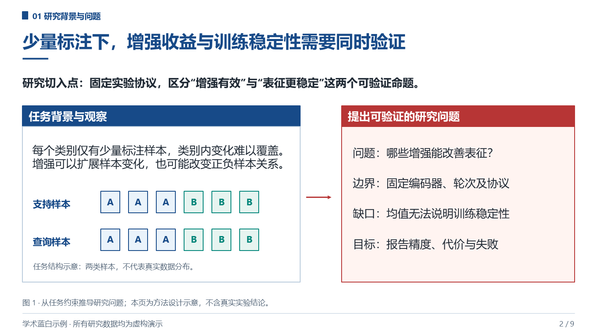 |  |  |
| 方法架构 | 结果图表 | 曲线与排查链 |
| 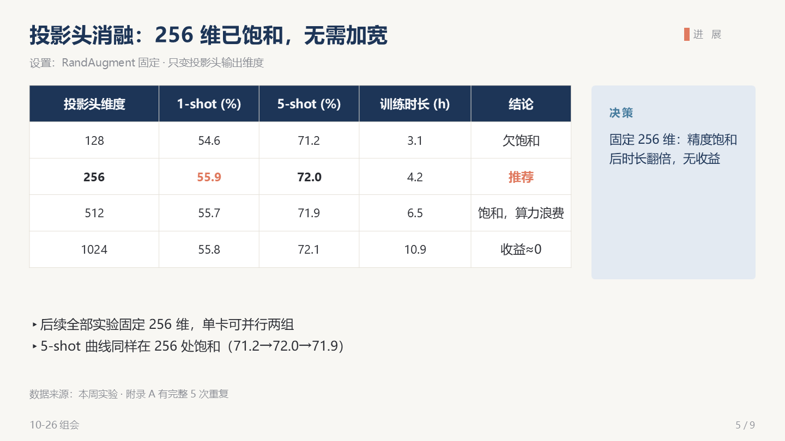 | 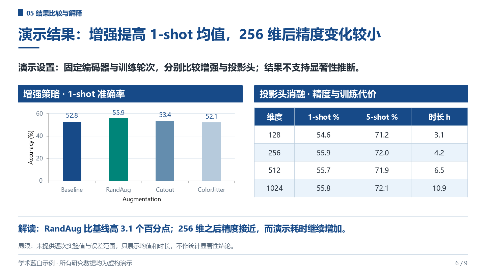 | 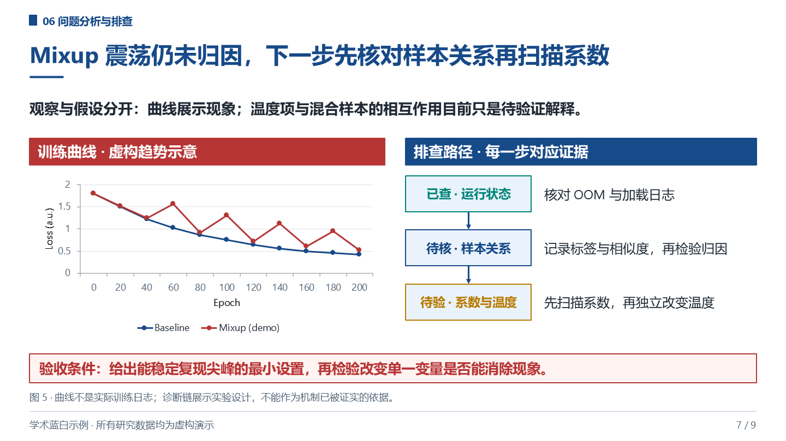 |

[下载完整 PPTX](examples/group-meeting-demo/group-meeting-demo.pptx) ·
[生成脚本](examples/group-meeting-demo/build_demo.js) ·
[全部页面预览](examples/group-meeting-demo/render/)

文字为文本框，示意图为形状与连线，数据图表内嵌工作簿，表格可直接修改。
图表原始演示数值存放在对应页备注中。

## 怎么做出预览图里的这些版式

> **先说清楚最容易混淆的一点：主题只换配色，版式要单独指定。**
> 上面 19 套主题的效果图刻意用了同一页内容，是为了控制变量、只看配色差异；
> **那不代表技能只会一种版式。** 真实汇报里每页构图都不同：请看上面「9 页可编辑示例」的六宫格、
> [`group-meeting-demo`](examples/group-meeting-demo/) 的完整 9 页，以及下面「场景骨架预览」的六宫格。

| 层 | 决定什么 | 怎么指定 |
|---|---|---|
| 场景骨架 | 整份 deck 的页面顺序、每页承担的研究任务、时长 | 说「组会 / 会议 / 进展 / 答辩 / 开题 / 文献分享」 |
| 单页构图 | 这一页用哪张图解释哪个结论 | 在请求里点名构图，或让 agent 按 [`academic-blue.md`](skills/lyceum/references/academic-blue.md) 规划 |
| 主题 | 只改配色、纸底、卡片、封面、图表色阶、标志图形颜色 | 从 19 套里点名 —— **主题名不改变版式** |

### 六宫格里的 6 种构图

| 构图 | 适合表达 | 提示词关键词 |
|---|---|---|
| 背景 → 科学问题 | 从证据/案例推出研究缺口 | `背景页：左侧原文证据，右侧写缺口` |
| 左流程、右论证 | 问题 / 方法 / 产物逐行对应 | `过程 + 解释，左侧三行流程右侧逐行论证` |
| 横向技术路线 | 输入 → 数据 → 方法 → 验证 → 输出 | `技术路线用横向流程，下方补阶段说明` |
| 方法架构 | 模块划分与数据流 | `方法页画原生架构图，节点和连线可编辑` |
| 结果与表格 | 主实验定量对照 | `结果页用原生柱状图 + 表格，本文行加粗高亮` |
| 曲线与排查链 | 诊断、失败分析、下一步 | `曲线 + 现象→已排除→当前假设→求助点` |

### 6 种不同版式长什么样

上面 19 张主题预览是「**同一版式**换配色」；下面两张是「**同一份 19 页真实组会汇报**抽出 6 种不同版式」：
背景→问题、过程+解释、技术路线、方法架构、结果与表格、曲线与诊断。
两张图之间只有配色不同，6 种版式完全一致 —— 这就是「主题改颜色、提示词改版式」的实际含义。

| 01 学术蓝白（默认） | 04 夜航实验室（深色） |
|---|---|
| <a href="examples/theme-preview/grids/grid-01.png">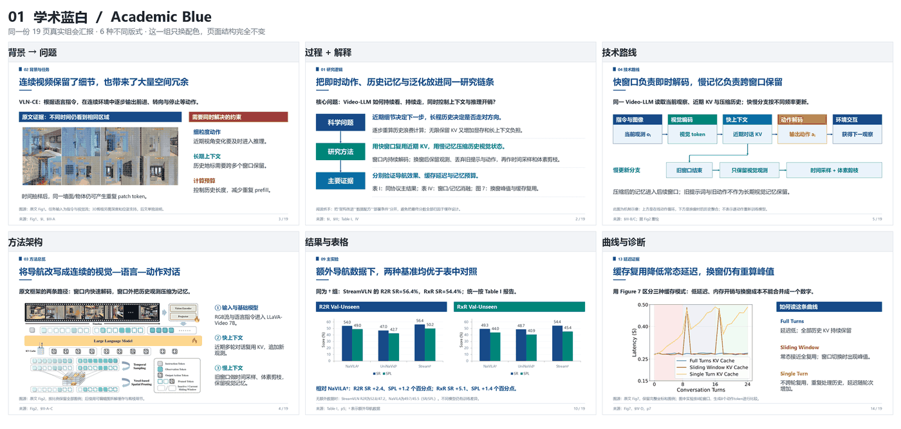</a> | <a href="examples/theme-preview/grids/grid-04.png">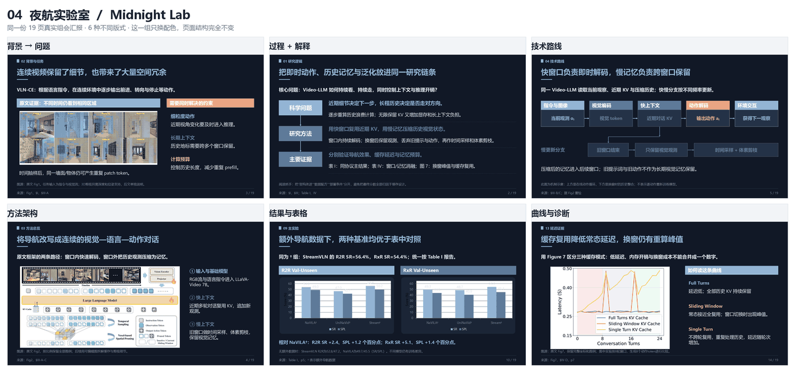</a> |

[19 套主题 × 6 种版式的全部六宫格](examples/theme-preview/grids/) · [一张图看全 19 套](examples/theme-preview/grids/grids-overview.png)

### 可复制提示词：一次要齐 6 种版式 + 指定主题

```text
用 Lyceum 做一份 12 页的组会汇报，视觉主题用「研纸墨蓝」。
按组会场景的页面顺序组织，每页完成一个研究任务，主体放一张能解释机制的图 + 一句判断：
- 背景页：左侧原文证据图，右侧写研究缺口
- 研究逻辑页：左流程右论证，问题/方法/产物三行逐行对应
- 技术路线页：横向流程（输入 → 数据 → 方法 → 验证 → 输出），下方补阶段说明
- 方法页：原生可编辑架构图，模块、连线、标注齐全
- 主结果页：原生柱状图 + 真实数据表，本文行加粗高亮
- 诊断页：曲线 + 现象 → 已排除 → 当前假设 → 求助点
不要每一页都用同一种卡片网格，不要重复同一版式；缺失的实验结果保持缺失，不要补造。
```

### 只给场景骨架，让 agent 自动混排版式

```text
用 Lyceum 做一份学位答辩 PPT，按答辩场景的页面骨架自动混排：
研究内容总览用三层框架图，创新点页用带标记的列表，每个研究内容用「问题→方法→验证」的镜像结构，
结果页用图表 + 表格。视觉主题用「学院蓝」。
```

6 种场景各自的页面顺序写在对应 `references/` 文件里；上面「场景骨架预览」的六宫格，
就是**同一套配色**下 6 种不同骨架的实际效果。

### 常见误区

- 只写「用藏青金主题」→ 只有配色变，版式不变，看起来就像「全都一样」。
- 写「做得丰富一点 / 版式多样一点」→ 没落到具体构图，agent 不会自动换。
- 每页都套同一个卡片网格 → 违反 `academic-blue.md` 里「不要重复一种卡片网格」的共享规范。
- 指望 `theme-index.md` 管版式 → 它只列配色和主题提示词，版式规则在 `academic-blue.md` 与场景参考里。

**验收**：翻一遍成品，看是否至少有 4 种明显不同的页面构图、每个内容页是否有一张实质图示 + 解读、
图表和表格是否原生可编辑。如果每页长得都一样，说明请求里没有指定版式。

## 六套学术场景

| 场景 | 建议时长 | 场景参考 |
|---|---|---|
| 组会汇报 | 15–40 分钟 | [group-meeting.md](skills/lyceum/references/group-meeting.md) |
| 学术会议报告 | 12–20 分钟 | [conference.md](skills/lyceum/references/conference.md) |
| 科研进展 / 中期 / 结题 | 15–30 分钟 | [progress.md](skills/lyceum/references/progress.md) |
| 学位论文答辩 | 15–40 分钟 | [defense.md](skills/lyceum/references/defense.md) |
| 开题报告 | 10–20 分钟 | [proposal.md](skills/lyceum/references/proposal.md) |
| 文献分享 / Journal Club | 20–45 分钟 | [paper-reading.md](skills/lyceum/references/paper-reading.md) |

场景参考决定论证结构；视觉主题从 [`theme-index.md`](skills/lyceum/references/theme-index.md) 里选；`academic-blue.md` 提供所有主题共享的网格、字体与密度规范。
场景**不锁定配色**：每个场景文件附带的 3 套主题只是推荐分组，可跨场景取用。用户提供的院校模板和参考图优先。
### 场景骨架预览（配色相同，结构不同）

这 6 页全部使用默认学术蓝白配色，只换页面骨架与论证顺序。
[6 页拼版总览图](examples/theme-preview/scenario-overview.png)。

|  |  |  |
|---|---|---|
| **1 组会汇报**<br><a href="examples/theme-preview/scenario-1.png">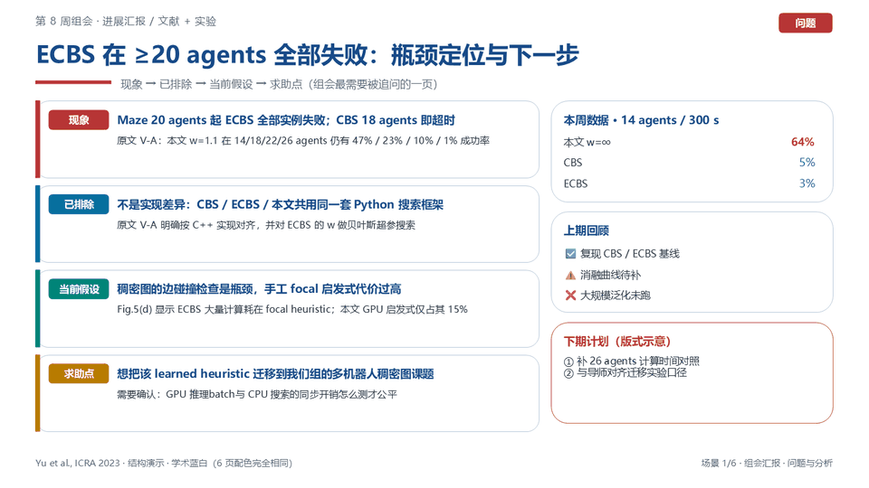</a> | **2 学术会议报告**<br><a href="examples/theme-preview/scenario-2.png"></a> | **3 科研进展**<br><a href="examples/theme-preview/scenario-3.png">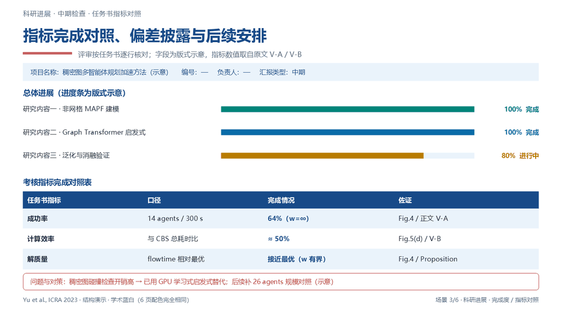</a> |
| **4 学位答辩**<br><a href="examples/theme-preview/scenario-4.png">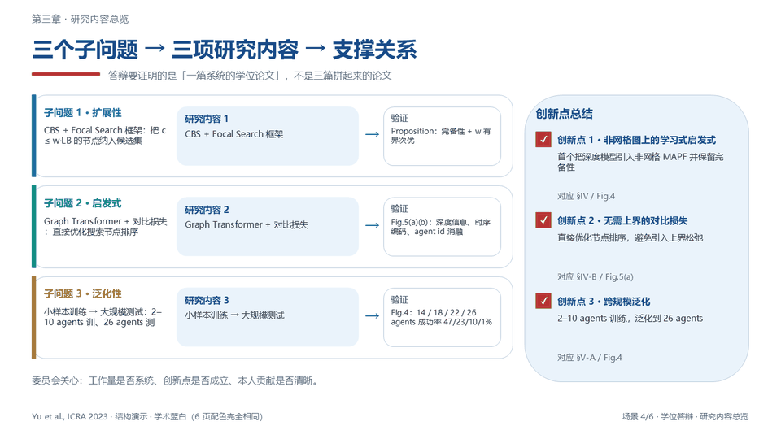</a> | **5 开题报告**<br><a href="examples/theme-preview/scenario-5.png"></a> | **6 文献分享**<br><a href="examples/theme-preview/scenario-6.png">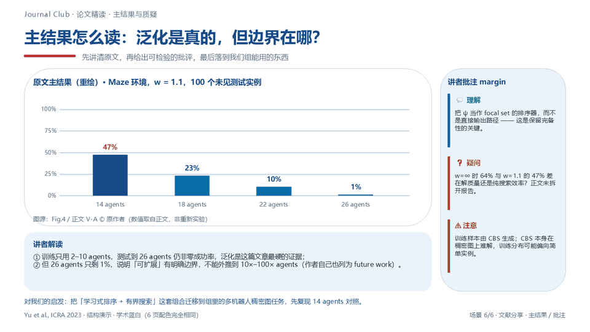</a> |

## 安装技能

```bash
git clone https://github.com/XiaoMa-77/academic-ppt.git
cd academic-ppt

# Claude Code
mkdir -p ~/.claude/skills
cp -r skills/lyceum ~/.claude/skills/

# 兼容 .agents/skills 的智能体
mkdir -p ~/.agents/skills
cp -r skills/lyceum ~/.agents/skills/
```

Windows PowerShell 可以使用：

```powershell
New-Item -ItemType Directory -Force "$env:USERPROFILE/.agents/skills" | Out-Null
Copy-Item -Recurse skills/lyceum "$env:USERPROFILE/.agents/skills/"
```

对话示例（这条点名了主题，因此**不会**用学术蓝白）：

```text
用 Lyceum 做一份开题汇报，视觉主题用「蓝图青」。
每页保留研究问题、方法细节和对应图示，技术路线用横向流程，
研究内容用左流程右说明。根据我给的数据制作结果图，不要补造结果。
```

要用兜底风格，请明确写「用默认学术蓝白，不用再问风格」。更多模板（跨场景组合、院校模板、整份换风格、验收清单）见 `theme-index.md`。

## 构建与测试

需要 Node.js 22+、Python 3.10+。请在仓库根目录执行：

```bash
npm ci
python -m pip install -r requirements-qa.txt
bash scripts/verify.sh
```

`verify.sh` 依次执行：Python 语法编译 → `npm test` → `npm run build` → `npm run qa`。
也可以单独运行各步骤：

```bash
npm test          # 运行 examples/qa-selftest/ 下的离线单元测试
npm run build     # 生成示例 PPTX
npm run qa        # 程序化 QA，附带 --academic 密度与图示提示
```

- `build` 生成 9 页示例，自动规范化生成库的重复段落属性，保留中英混排与原生对象。
- `qa` 检查溢出、越界、文本重叠、占位符、字体、可编辑性和已知 XML 兼容性问题；
  `--academic` 同时输出正文量、图表/表格/图片和流程图候选提示。
- `test` 自动发现 `examples/qa-selftest/test_*.py`，运行离线回归套件：QA 核心启发式与阈值边界、
  CLI 退出码与 JSON 报告结构，以及原有负向夹具。其中 1 项渲染检查显式跳过，因为它需要真实
  PowerPoint；完整测试策略见 [DESIGN.md](DESIGN.md)。
- GitHub Actions 在推送和 PR 时重建示例、运行 QA 与回归测试，并保存 PPTX 构建产物。

自定义输出位置：

```bash
node examples/group-meeting-demo/build_demo.js /path/to/output.pptx
```

需要换 Python 解释器时设置环境变量 `PYTHON`，例如
`PYTHON="py -3.12" bash scripts/verify.sh`。该变量对 `verify.sh`、`npm test`、
`npm run qa` 和构建脚本均生效。图像尺寸依赖固定为修复版本，安装由 `package-lock.json` 锁定。

## 渲染与视觉复核

Windows 安装 PowerPoint 后：

```powershell
./skills/lyceum/scripts/render_powerpoint.ps1 `
  -DeckPath examples/group-meeting-demo/group-meeting-demo.pptx `
  -OutDir examples/group-meeting-demo/render
```

脚本以只读方式打开 PPT，逐页导出 1440×810 预览；打不开或导出失败时立即报错。
其他平台可用 LibreOffice 转 PDF，再用 `pdftoppm` 导出页面，需安装相应中文字体。

程序化检查是启发式检查。交付前仍需逐页查看字体、标签、连线、标点、数值来源和图表解读。
`--academic` 的“流程图候选”只表示检测到形状和线条，不能判断科研逻辑。

## 仓库结构

```text
DESIGN.md                         # 背景、架构、接口、数据流、边界场景、测试策略与假设
skills/lyceum/
  SKILL.md                         # 路由、内容方法、原生编辑约束
  references/theme-index.md        # 19 套主题、色值、选择规则、提示词模板、验收清单
  references/academic-blue.md      # 共享网格/字体/密度/图示规范（兜底配色）
  references/                     # 六套场景骨架 + 各场景的主题色值
  scripts/qa_check.py              # 质量检查与密度提示
  scripts/normalize_pptx.py        # 生成文件 XML 兼容处理
  scripts/render_powerpoint.ps1    # Windows 原生渲染验证
examples/theme-preview/            # 19 套主题 + 6 种场景效果图与拼版总览
examples/theme-preview/grids/      # 19 张「同主题 6 版式」真实汇报效果图
examples/group-meeting-demo/       # 9 页示例、脚本和全部预览
examples/qa-selftest/              # 缺陷样例与回归检查
  test_qa.py                       # 密度、原生图示、XML 兼容性
  test_qa_core.py                  # QA 核心启发式与阈值边界
  test_qa_cli.py                   # CLI 退出码与 JSON 报告结构
scripts/verify.sh                  # 本地一键校验
scripts/py.js                      # 跨平台 Python 启动器（npm 脚本用）
.github/workflows/quality.yml      # 自动构建与测试
```

贡献新场景时请给出真实页面任务与图示方案；修改示例后重新构建、QA、渲染并查看所有页面。
技能入口保持精简，详细规范放入 `references/`。

[MIT](LICENSE) © 2026 Lyceum 贡献者。
